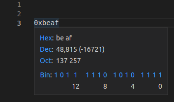

# Plugin that shows a number in 10, 16, 2 and 8 numeral systems for VS Code

This plugin converts the hovered number in decimal, hexadecimal, binary or octal numeral systems and displays a popup that shows the result in all four (dec, hex, bin and oct) numeral systems.

### Additional functionality
* Pressing any digit of binary number makes it opposite of it's current value.
* Pressing hex/dec/oct/bin will convert number to selected numeral system.

## FIXME:
Here is the list of some troubles in the plugin I have no solution for:
- slow hover content update after bit change or convert operation;
- hover is too small for big numbers;
- problems with big numbers (probably BigInt could solve them but doesn't work with old VS code version).
